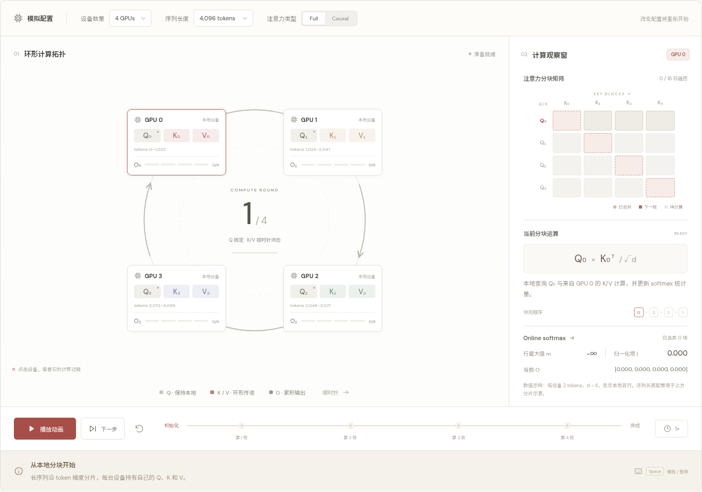
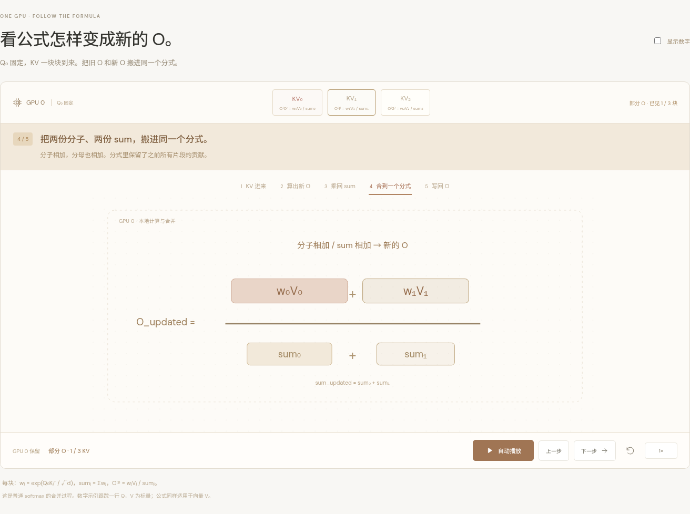

# Ring Attention · 交互计算演示

一个基于 Vue 3 + Vite 的中文交互教学页面。

在线演示：[GitHub Pages](https://wangmerlyn.github.io/ring-attention-illustration/)，[单 GPU online softmax 动画](https://wangmerlyn.github.io/ring-attention-illustration/#online-softmax)。

推荐 Node.js 22.12+ 与 npm。使用 `.nvmrc` 可通过 `nvm use` 选择 Node.js 22。

```sh
npm ci
npm run dev -- --port 5173
```

浏览器访问 `http://localhost:5173`。

如果在远程开发环境中预览，请转发服务端的 5173 端口；浏览器中的临时转发端口只用于本次访问。

## 演示截图

环形计算拓扑：



单 GPU 的 online softmax 公式合并：



更多手机截图及早期迭代截图见 [docs/previews](docs/previews/README.md)。

## 交互

- 播放、暂停、继续、单步执行、重置，以及 0.5× / 1× / 2× 速度。
- 点击进度节点回到指定轮次；点击 GPU 或矩阵行观察该设备。
- 支持 4 / 6 / 8 台设备、三种序列长度，以及 full / causal attention。
- Space 播放或暂停；右方向键执行一轮；R 重置（控件聚焦时保留原生键盘行为）。
- 展开计算细节可查看 online softmax 公式和通信 / 计算重叠示意。

## 计算约定

### 单 GPU online softmax 动画

导航中的 **Online softmax**（`#online-softmax`）打开固定画布上的单 GPU 公式动画。固定 GPU 0 的一行 Q，KV₀ 的部分输出作为起点；KV₁、KV₂ 依次到来。每块有五个画面：KV 入场、形成新 O 的分式、sum 乘数移动到分母旁并消去、两份分子和 sum 移入同一个分式、把新的 O 与 sum 一起写回。

公式块以 SVG 实际移动，播放/暂停控制同一条动画时钟，单步会完成一段移动后停止。支持后退、选择片段或步骤、重置、0.5×/1×/2× 速度与键盘控制。默认展示符号表达式；勾选“显示数字”可查看真实分子、分母与保存的 O、sum。手机窄屏内可左右滑动画布。

本段使用普通 softmax `wⱼ=exp(Q₀Kⱼᵀ/√d)`、`sumⱼ=Σwⱼ`、`O⁽ʲ⁾=wⱼVⱼ/sumⱼ`，保留部分输出和累计分母。乘回各自 sum 还原分子后，合并公式为 `O新=(O旧×sum旧+O块×sum块)/(sum旧+sum块)`。新旧两份 sum 仍需要一起作为新分母；临时动画不会提前覆盖保存的 O 与 sum。

数值示例使用得分 `[1,2]`、`[3,1]`、`[2,0]` 和对应标量 V `[2,4]`、`[8,6]`、`[1,5]`。无掩码，计算不提前舍入，显示三位小数。向量 V 逐维使用相同的合并比例。启用减少动态效果时直接切换公式状态。上方环形模拟及高级计算细节仍采用数值稳定的在线累积实现。

展示 attention **前向计算**。设备沿顺时针发送 K/V，Q 和输出始终归属于原设备。第 r 轮（从 0 开始）设备 i 使用 `(i - r + N) % N` 的 K/V，共 N 轮计算、N−1 次通信；最后一轮不再发送。

动画中的移动 K/V 是发送副本，设备继续使用当前缓冲区计算；本轮结束后使用收到的分块。每个轮次期间计算和通信同时发生，暂停冻结二者。减少动态效果的系统设置会禁用移动数据包，但保留过程、计时和状态展示。

右侧数值计算使用独立的小型确定性数据集：每设备 2 tokens，单头维度 d=4。序列长度配置只控制分片范围标注，不将大量 token 展开到浏览器。计算每个查询行的在线统计量 m、ℓ 和未归一化加权和 u；最终 O=u/ℓ。完成后与独立全量 attention 对比。Causal 模式同时应用跨块与块内 token 级掩码。

矩阵是遍历覆盖示意，不是实际注意力权重。因果模式的对角格用半斜面表示块内掩码；上三角分块完全跳过。通信重叠效果取决于块大小和硬件，页面时间轴不代表性能基准。

## 验证与构建

```sh
npm test
npm run build
npm run preview -- --port 4173
```

## GitHub Pages 部署

`.github/workflows/pages.yml` 在 `main` 更新时自动构建并发布，也可以在 GitHub Actions 中手动运行。构建先执行全部计算测试，然后将 `dist/` 部署到 GitHub Pages；仓库的 Pages 发布源使用 GitHub Actions。

Pages 位于仓库子路径 `/ring-attention-illustration/`，专用构建命令会设置 Vite 的资源前缀。本地开发和普通构建仍使用根路径。复现 Pages 构建并检查子路径：

```sh
npm run build:pages
npm run preview -- --port 4173 --base=/ring-attention-illustration/
```

浏览器访问 `http://localhost:4173/ring-attention-illustration/`。JS、CSS 和 favicon 都会使用这个前缀；页面内的 hash 导航和动画无需后端服务。

测试覆盖所有设备和查询行的 full / causal 与 dense attention 等价性、ring 访问顺序、不整除序列的完整分片、大幅值下的数值稳定性和全掩码分块处理。

参考：[Ring Attention with Blockwise Transformers for Near-Infinite Context](https://arxiv.org/abs/2310.01889)，Liu, Zaharia & Abbeel，2023。

字体使用 Google Fonts 的 DM Sans / Noto Sans SC；网络不可用时自动回退系统字体。应用依赖安装后，计算和动画均在浏览器本地运行。
